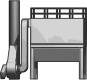

# fuxa-widget-library

This library contains a collection of SVG-based multi-state symbols specifically designed for use in [FUXA](https://github.com/frangoteam/FUXA) industrial HMI/SCADA dashboards — focused on mining and material handling processes.

---

## Folder Overview

- [`iframes/`](./iframes) – Custom iframe-based widgets.
- [`mining/`](./mining) – Multi-state symbols for mining systems (e.g. conveyors, crushers).
- [`static-symbols/`](./static-symbols) – Static SVG graphics for general use.

---

## Installation

To install these widgets in your FUXA project:

1. Download or clone this repository.
2. Place the eg the `mining/` folder inside FUXA’s widget directory (`/server/_widgets/`).
3. Refresh the browser tab running the FUXA editor.
4. Insert the SVG widgets via the FUXA editor under the Widgets pane.
---

## Request New Widgets

Want a specific symbol or have an idea?

- [Open an issue](https://github.com/tobias-carlbom/fuxa-widget-library/issues) with a description and (if possible) a reference image.
- Or contribute your own SVGs via a pull request.

---

## Widget Previews

### [`mining/`](./mining)

All widgets are located in the `mining/` folder and support dynamic state-based color changes.

| Widget | Preview |
|--------|---------|
| cone-crusher |  |
| conveyor-3d-left |  |
| conveyor-3d-right |  |
| conveyor-feeder |  |
| conveyor-long |  |
| conveyor-medium |  |
| conveyor-medium2 |  |
| conveyor-short |  |
| feeder-hopper |  |
| feeder-left |  |
| feeder-left2 |  |
| feeder-right |  |
| filter |  |
| gyratory-crusher |  |
| hopper-flat |  |
| hopper-round |  |
| motor |  |
| screen |  |
| screen2 |  |

---

### 🔧 Multi-State Logic and Behavior

Each widget supports dynamic visuals based on a set of predefined state variables embedded in the SVG script block.
Below is shown the most important state variables that you can bind directly in FUXA editor.

#### `_pn_setState` (Number)

Controls the current state of the widget. Used to change fill color based on system condition.

| `_pn_setState` | Color     | Preview | Description            |
|----------------|-----------|---------|------------------------|
| `0`            | `#ffffff` | ⬜️       | Inactive / Neutral     |
| `1`            | `#00ff00` | 🟩       | Running / OK           |
| `2`            | `#ff9500` | 🟧       | Warning                |
| `3`            | `#ff0000` | 🟥       | Blinking Alarm / Fault          |
| `4`            | `#3c3c3c` | ⬛️       | Stopped / Offline      |
| `5`            | `#dcdcdc` | ◻️       | Disconnected / Unknown |

---

#### `_pn_indicationMode` (Number)

Controls how the visual indication is rendered:

- `0`: Fill only (default)
- `1`: Stroke only
- `2`: Fill + Stroke
